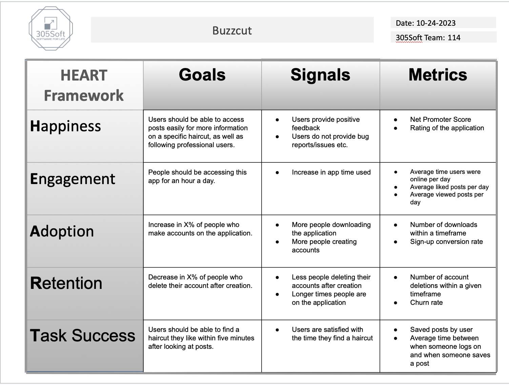

## Heartframe

Metric 1 - In order to measure Net Promoter Score, we would offer users a chance to rate our app. This would either be a pop-up window or a small button on the profile or settings screen. A link would redirect them to a Google Survey that asks them to rate the app 1-10. We can then calculate the Net Promoter Score using the data from the survey.

Metric 2 - In order to measure the User Session Time, we will save the time from when they first access the applciation, then save the time as they leave, then calculate the Session Time for each user and save it to a seperate metrics connection database. This can be done by creating a timestamp in Firebase given a log in and log out time specified then calculating the time spent in app.
